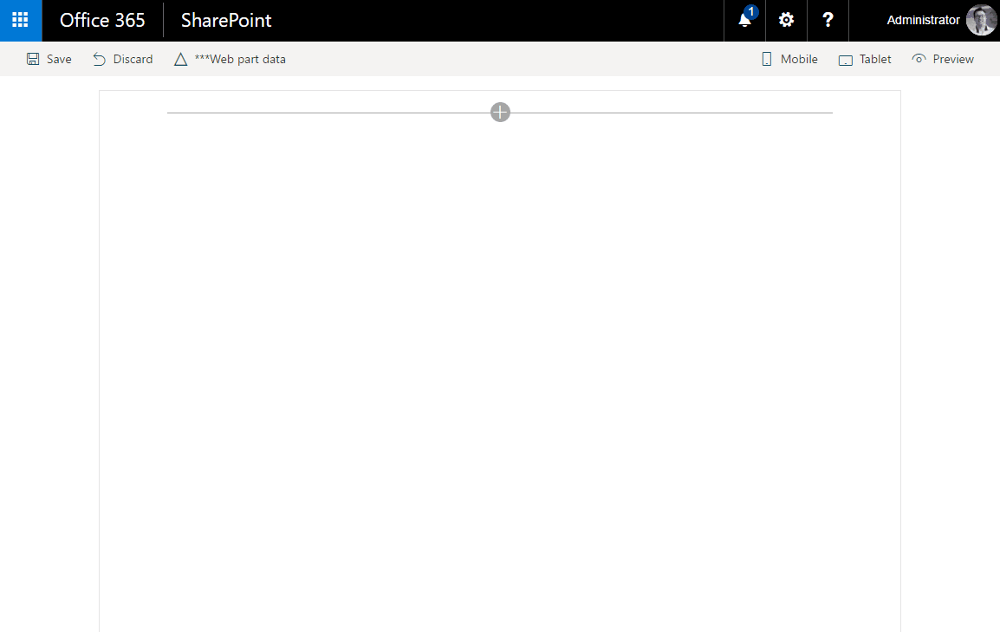

# Display List RiotJS Client-Side Web Part

## Summary
Simplistic sample Web Part that demonstrates the use of RiotJS in creating a SharePoint Framework web part. The properties pane for this web part display a drop down list of lists in the current web. Once the user selects one of the lists, the web part display the contents of the list.

.

> Does only show data when hosted in SharePoint. No mock data at this point for local testing the rendering.

## Used SharePoint Framework Version 

## Applies to

* [SharePoint Framework General Availability](http://dev.office.com/sharepoint/docs/spfx/sharepoint-framework-overview)
* [Office 365 developer tenant](http://dev.office.com/sharepoint/docs/spfx/set-up-your-developer-tenant)

## Solution

Solution|Author(s)
--------|---------
spfx-riot-list|Sébastien Levert (MVP, Valo Intranet, @sebastienlevert)

## Version history

Version|Date|Comments
-------|----|--------
1.0|April 26, 2017|Initial release

## Disclaimer
**THIS CODE IS PROVIDED *AS IS* WITHOUT WARRANTY OF ANY KIND, EITHER EXPRESS OR IMPLIED, INCLUDING ANY IMPLIED WARRANTIES OF FITNESS FOR A PARTICULAR PURPOSE, MERCHANTABILITY, OR NON-INFRINGEMENT.**

---

## Minimal Path to Awesome

- Clone this repository
- in the command line run:
  - `npm install`
  - `gulp serve`
  - `Open the *workbench* on your Office 365 Developer tenant`
      - Basic functionality can be tested locally, data is only shown when used in context of SharePoint

## Features
The spfx-riot-webpart web part displays the content of the list specified in the web part properties pane.

This Web Part illustrates the following concepts on top of the SharePoint Framework:

* Using RiotJS as the component rendering engine
* The use of modular CSS
* The use of PnP JS Core with async/await support in TypeScript